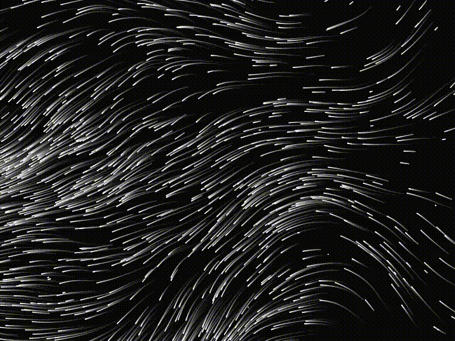

# Individual 
## 1 Interaction Instructions
- The interaction in my personal code is that the building animation in the screen will start automatically and run continuously. Wait for the image and particles to load, which may take a few seconds. Press the spacebar to toggle between displaying the full image and drawing segments.
## 2 Code Explanation
- I utilized arbitrary values of the Perlin noise function and random particle motion. 
- In Shona's personal code, it's more of a keyboard or mouse interaction. Mine uses particles to show flow effects on buildings and will have gradient colors.
- This motion picture inspired me to think about using it on buildings.
- 
- My personal code dynamic effect samples colors from the sky and buildings of the loaded image to ensure that the drawn elements match the underlying image. The particles have a fluorescent effect, implemented using the ADD blending mode to make them stand out vividly against the background.
  - Not much was changed in the panel code. The panel code creates a dynamic background as the background sky color smoothly transitions between the two gradient colors over time.
  - I used out-of-course blending modes (ADD and BLEND) for the fluorescent effect of the particles.
  - The technique I used was learned from the following website. Used perlin noise particle effects. Helped me to achieve the particle flow effect of the building.
- 

# GroupAssignment
 
map()

pointsBuffer = createGraphics(windowWidth, windowHeight); 

[The San Giorgio Maggiore at Dusk](https://shonaliu.github.io/GroupAssignment/)

### Gradient coloured skies and buildings with changing shapes.
    - The movement of the dot trajectory draws buildings that transform into different shapes as well as the sky. The sky can fade in colour from blue to yellow depending on the time of day.
- Inspired by 
- 
- 